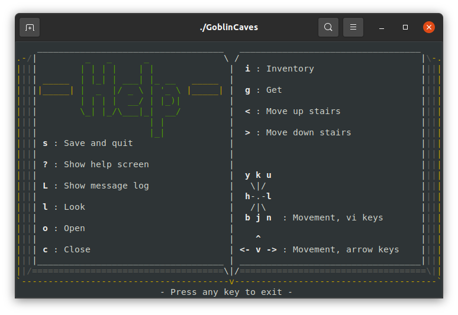

## Project codename: "Goblin Caves"

A dungeon crawling roguelike project, written in good ol' C. 

The goal of this project is to establish a codebase that I can play around in,
incorporate and expand on all the ideas I've had with previous projects... Not
to have a "finished" game, although that would be a nice bonus. 

Requires make, building only tested successfully on various flavors of linux.

Read more about this project on
[the blog](https://zwilder.github.io/tags/goblin-caves).

