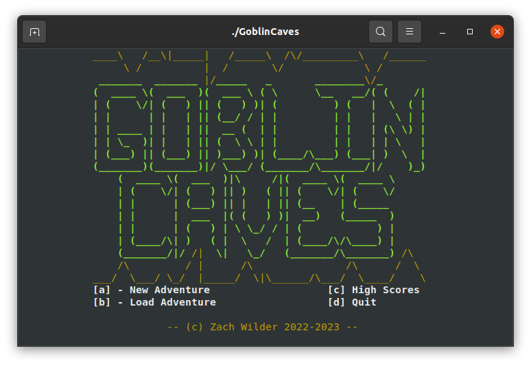

## Project codename: "Goblin Caves"



A dungeon crawling roguelike project, written in good ol' C. 

The goal of this project is to establish a codebase that I can play around in,
incorporate and expand on all the ideas I've had with previous projects... Not
to have a "finished" game, although that would be a nice bonus. 

Requires make and ncurses, building only tested successfully on various flavors
of linux.

[](https://replit.com/@zwilder/goblincaves)
---

Game commands:
```
q : Quit
o : Open
c : Close
< : Move up stairs
> : Move down stairs
? : Open help menu

y k u
 \|/
h-.-l   : Movement, vi keys
 /|\
b j n

  ↑
← ↓ →   : Movement, arrow keys
```
